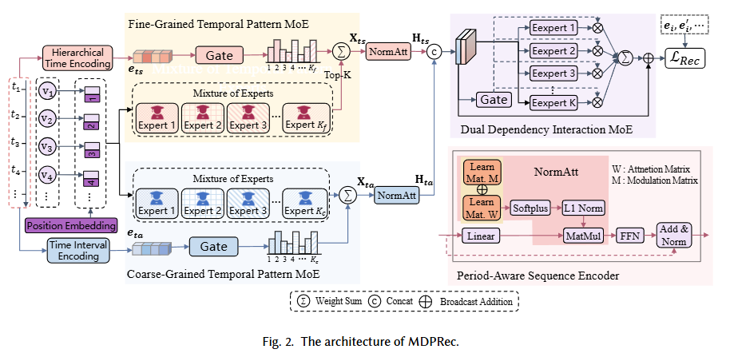

# MDPRec: Empowering Sequential Recommendation through Multi-Scale Temporal Decoupling and Periodic Pattern Modeling

The source code for our paper ["MDPRec: Empowering Sequential Recommendation through Multi-Scale Temporal Decoupling and Periodic Pattern Modeling"].

The architecture of MDPRec, as shown in Figure 1. MDPRec is a dual-branch framework, which comprises four key components. 
(1) Time Encoding: It first encodes timestamps into a time interval embedding and a hierarchical timestamp embedding. 
(2) Mixture-of-Experts (MoE): A Coarse-grained Temporal MoE (CMoE) and a Fine-grained Temporal MoE (FMoE), which adaptively extract patterns at their respective temporal scales. 
(3) Period-Aware Sequence Encoder: It encodes the sequence with an emphasis on period dependencies. 
(4) Dual Dependency Interaction MoE (DMoE): It fuses the two branches to model cross-scale interactions and produces a unified user representation for next-item prediction. 



<p align="left"><b>Figure&nbsp;1</b> The architecture of the MDPRec.</p>


##  Experimental Details
### 1. Implementation Details & Fairness Protocol
To ensure reproducibility and a rigorous fair comparison, all experiments are conducted on a unified hardware platform with a single Nvidia RTX PRO 6000 with 96 GB of VRAM. MDPRec is implemented in PyTorch.

###  2. Datasets

Download datasets (Beauty、 Video、 Electronics) from [Amazon product data](https://cseweb.ucsd.edu/~jmcauley/datasets/amazon/links.html) and [LastFM](https://grouplens.org/datasets/hetrec-2011/). And put the files in `./dataset/`. After that, use the data preprocessing code to preprocess the data. We provide the processed Beauty dataset [link](https://drive.google.com/drive/folders/1e0xO6On-Yo2p4dsESG6ZX-u6jxP6cRyi?usp=drive_link) for your reference. After downloading, just unzip the zip file into the folder of `./dataset/`. At the same time, you can also download the trained model.

###  3. Training MDPRec Model

#### 3.1  Environment  

```bash
pip install -r requirements.txt
```

#### 3.2 Running Instruction

To run MDPRec, just use the following code.

```
python run_mdprec.py --model MDPRec --dataset xx
```

  Baseline
```
python run_baseline.py --model xx --dataset xx
```

# Acknowledgement
Our implementation is based on [Recbole](https://github.com/RUCAIBox/RecBole). Thanks for the splendid codes for these authors.

