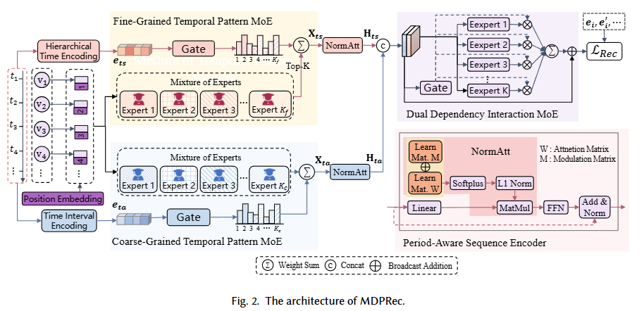
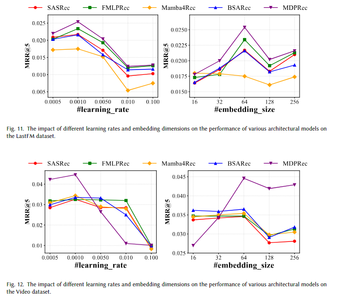

# MDPRec: Empowering Sequential Recommendation through Multi-Scale Temporal Decoupling and Periodic Pattern Modeling

The source code for our paper ["MDPRec: Empowering Sequential Recommendation through Multi-Scale Temporal Decoupling and Periodic Pattern Modeling"].

The architecture of MDPRec, as shown in Figure 1. MDPRec is a dual-branch framework, which comprises four key components. 
(1) Time Encoding: It first encodes timestamps into a time interval embedding and a hierarchical timestamp embedding. 
(2) Mixture-of-Experts (MoE): A Coarse-grained Temporal MoE (CMoE) and a Fine-grained Temporal MoE (FMoE), which adaptively extract patterns at their respective temporal scales. 
(3) Period-Aware Sequence Encoder: It encodes the sequence with an emphasis on period dependencies. 
(4) Dual Dependency Interaction MoE (DMoE): It fuses the two branches to model cross-scale interactions and produces a unified user representation for next-item prediction. 
In addition, we discuss the computational complexity of **MDPRec** in document [complexity-analysis.pdf](https://github.com/0-1user/MDPRec/blob/master/complexity-analysis.pdf).


<!-- <p align="left"><b>Figure&nbsp;1</b> The architecture of the MDPRec.</p> -->

## Appendix B
**Analysis of the Impact of Learning Rates and Embedding Dimensions on Model Performance**

To provide direct evidence for the use of fixed learning rates and embedding dimensions in MDPRec and baseline
models, we selected models encompassing Transformer, MLP, Mamba architectures, frequency modelling, and MDPRec
methods for experiments. Specifically, on the LastFM and Video datasets, we fixed all other training parameters and
varied only the learning rate or embedding dimension in each iteration to obtain recommendation results from the five
models. As shown in Figure 11-12, we observe that: (1) The five models with different architectures exhibit consistent
trends in learning rate on the LastFM and Video datasets, and the best results are obtained when the learning rate is
0.001. (2) Except for MDPRec, SASRec, FMLPRec, BSARec exhibit consistent trends in embedding dimension, MDPRec
may demonstrate a stronger advantage in high-dimensional modeling due to its unique structure. The Figure 11-12
show that when the embedding dimension is set to 64, four models deliver the best performance, Mamba4Rec delivers
competitive performance. Therefore, it is reasonable to set the learning rate to 0.001 and the embedding dimension to
64 for MDPRec and the baseline models; this is also consistent with the settings in the paper [2, 8, 19, 25, 26, 28, 57].



##  Experimental Details
### 1. Implementation Details & Fairness Protocol
To ensure reproducibility and a rigorous fair comparison, all experiments are conducted on a unified hardware platform with a single Nvidia RTX PRO 6000 with 96 GB of VRAM. MDPRec is implemented in PyTorch. For reproducibility, we introduce the best hyperparameter configurations of baselines for each dataset in document [hyper.pdf](https://github.com/0-1user/MDPRec/blob/master/hyper.pdf).

###  2. Datasets

Download datasets (Beauty、 Video、 Electronics) from [Amazon product data](https://cseweb.ucsd.edu/~jmcauley/datasets/amazon/links.html) and [LastFM](https://grouplens.org/datasets/hetrec-2011/). And put the files in `./dataset/`. After that, use the data preprocessing code to preprocess the data. We provide the processed dataset [link](https://drive.google.com/drive/folders/1e0xO6On-Yo2p4dsESG6ZX-u6jxP6cRyi?usp=sharing) for your reference. After downloading, just unzip the zip file into the folder of `./dataset/`. At the same time, you can also download the trained model.
 
###  3. Training MDPRec Model

#### 3.1  Environment  

```bash
pip install -r requirements.txt
```

#### 3.2 Running Instruction

To run MDPRec, just use the following code.

```
python run_mdprec.py --model MDPRec --dataset xx
```

  **Baseline**

  The model implementation and configuration files are located in the `recbole_baseline` folder
```
python run_baseline.py --model xx --dataset xx
```

# Acknowledgement
Our implementation is based on [Recbole](https://github.com/RUCAIBox/RecBole). Thanks for the splendid codes for these authors.

